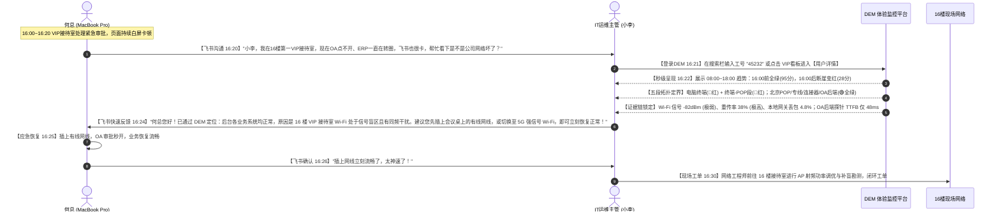

# 何总排障剧本真实特征还原与改造方案

本方案针对 DEM 系统中方案五（及方案四等同步页面）的【何总专属排障剧本】进行全面重构与真实性还原。修正此前逻辑偏差，建立完全自洽的排障证据链与拓扑状态表达。

---

## 一、改造核心目标与逻辑修正

根据网络排障与 DEM 拓扑设计规范，本次改造重点解决以下逻辑问题：

1. **工号与基本信息修正**：
   - 何总工号由 `4343` / `45343` 统一变更为 **`45232`**（显示名称：`45232（何总）`）。
   - 部门：`深信服科技 / 总裁办 / 总经办`，接入北京 POP。
2. **拓扑节点与链路状态规范修正**：
   - **根因定界**：定位为**终端 Wi-Fi 信号弱、同频竞争导致高重传与网关丢包**。
   - **拓扑表达规则**：
     - **【💻 终端节点】**：包含 Wi-Fi 环境指标（RSSI、重传率、协商速率、信噪比），因此终端节点状态必须为 **🔴 异常**（`status: '异常'`）。
     - **【⚡ 终端-POP链路段】**：受终端本地 Wi-Fi 物理层/空口劣化直接拖累，时延升高、丢包增加、有效吞吐骤降，链路段状态必须为 **🔴 异常**（`status: '异常'`）。
     - **【☁️ 北京POP节点】**：转发正常、无限流，状态为 **🟢 正常**。
     - **【🔗 POP-连接器段】**：专线传输质量良好，状态为 **🟢 正常**。
     - **【🚪 总部连接器】**：集群健康、负载低，状态为 **🟢 正常**。
     - **【🏢 连接器-应用段】**：内网千兆直连互通，状态为 **🟢 正常**。
     - **【🖥️ 目标应用节点（如OA系统）】**：应用服务本身健康（健康探针 HTTP 200，内部耗时 48ms 正常），状态为 **🟢 正常**；终端侧真实感知到的 TTFB 变慢系被前端链路拉长。
3. **真实时段设定（16:00 ~ 16:30 访问全部异常）**：
   - 16:00 前（08:30 ~ 15:45）：在工位有线/优质 Wi-Fi 下办公，所有应用访问均为 **正常（绿色，TTFB 60~75ms，丢包 0%）**。
   - 16:00 ~ 16:30：进入 16 楼角落“第一VIP接待室”弱信号盲区，期间发起的全部应用访问（OA、ERP、邮箱、飞书等）统一出现卡顿和丢包。

---

## 二、剧本完整故事还原

### 1. 业务场景背景
* **发生时间**：2026-08-20 下午 16:00 ~ 16:30
* **当事人**：何总（工号 45232，总经办），终端设备为 MacBook Pro。
* **物理位置演变**：
  * **08:30 ~ 15:45**：何总在总裁办主工位办公，连接 5GHz 优质无线 AP，业务访问流畅，系统监控指标评分均在 92~96 分。
  * **16:00**：何总携带笔记本前往 16 楼角落的**“第一VIP接待室”**参加高管临时会议。
  * **16:00 ~ 16:30 物理环境**：该接待室处于走廊主 AP 的无线信号边缘衰减区（信号穿透两堵隔墙），且周边存在同频信号干扰。MacBook Pro 无线信号强度降至 **-82 dBm**，空口协商速率由 866 Mbps 断崖式降至 **13 Mbps**，无线重传率高达 **38%**。
  * **故障表象**：何总在此期间打开 OA 系统处理紧急审批、查阅 ERP 报表、接收邮件均出现明显白屏卡顿，飞书音视频提示“网络不稳定”。

### 2. 报障与 IT 运维保障全流程（飞书联动 + DEM秒级定界）



* **真实运维保障价值体现**：
  1. **免除推诿**：以往业务卡顿易被误判为“OA服务器崩了”或“运营商外网挂了”，导致研发/应用运维/网络团队互相推诿；
  2. **秒级定界**：IT 主管借助 DEM 全链路五段拓扑与终端 Wi-Fi 指标，在 **1 分钟内直接锁定终端本地 Wi-Fi 信号盲区**；
  3. **有据可循**：DEM 提供了 OA 后端健康探针（TTFB 48ms）和逐跳链路证据，向 VIP 用户解释清晰、应急方案准确有效；
  4. **闭环优化**：从应急指导（插网线）到现场 AP 调优，形成完整的 VIP 保障闭环。

---

## 三、访问应用与时序采样点数据设计

### 1. 受影响应用列表

| 应用名称 | 应用分类 | 16:00~16:30 体验 | 真实访问 TTFB | 丢包率 | 现象与说明 |
| :--- | :--- | :--- | :--- | :--- | :--- |
| **OA系统** | 内网办公 (ZTNA) | 🔴 **差** (主排障应用) | **1,420 ms** | **5.2%** | 审批流提交卡顿，探针证明后端服务器完全健康 |
| **ERP系统** | 核心业务 (ZTNA) | 🔴 **差** | **1,380 ms** | **5.0%** | 报表查询加载缓慢，验证多应用普遍受累 |
| **企业邮箱** | SaaS/内网邮件 | 🔴 **差** | **1,150 ms** | **4.6%** | 邮件附件下载频繁重试 |
| **飞书协同** | SaaS 协同/会议 | 🟡 **一般 / 差** | **420 ms (音视频)** | **5.2%** | 通话偶发卡顿，提示网络不佳 |
| 其余 12 个应用 | 研发/知识库等 | 🟢 **正常** | 60~75 ms | 0.0% | 16:00 前访问或当前时段无大流量请求 |

### 2. 08:00 ~ 18:00 离散稀疏采样点配置（重点聚焦 16:00~16:30 异常）

| 采样时间 | 槽位 (Slot) | 体验评级 | 综合评分 | 真实 TTFB | 丢包率 | 状态特征 |
| :--- | :--- | :--- | :--- | :--- | :--- | :--- |
| **08:30** | Slot 1 | 🟢 正常 | 95 分 | 68 ms | 0.0% | 正常办公工位 |
| **09:15** | Slot 3 | 🟢 正常 | 92 分 | 72 ms | 0.0% | 正常办公工位 |
| **10:00** | Slot 5 | 🟢 正常 | 96 分 | 64 ms | 0.0% | 正常办公工位 |
| **11:10** | Slot 8 | 🟢 正常 | 90 分 | 74 ms | 0.0% | 正常办公工位 |
| **13:40** | Slot 15 | 🟢 正常 | 91 分 | 71 ms | 0.0% | 正常办公工位 |
| **14:30** | Slot 18 | 🟢 正常 | 93 分 | 67 ms | 0.0% | 正常办公工位 |
| **15:15** | Slot 21 | 🟢 正常 | 89 分 | 78 ms | 0.1% | 正常办公工位 |
| **15:45** | Slot 23 | 🟢 正常 | 92 分 | 70 ms | 0.0% | 离开工位前最后一次访问 |
| **16:00** | **Slot 24 (主点)** | 🔴 **差** | **28 分** | **1,420 ms** | **5.2%** | **进入VIP接待室，Wi-Fi 弱信号盲区，重传 38%** |
| **16:08** | **Slot 25** | 🔴 **差** | **32 分** | **1,360 ms** | **4.9%** | **持续处于弱信号区，本地网关丢包 4.5%** |
| **16:15** | **Slot 26** | 🔴 **差** | **25 分** | **1,450 ms** | **5.5%** | **多终端同频干扰峰值，重传率 41%** |
| **16:22** | **Slot 27** | 🔴 **差** | **36 分** | **1,320 ms** | **4.6%** | **持续卡顿，Overlay 吞吐降至 6Mbps** |
| **16:30** | **Slot 28** | 🔴 **差** | **30 分** | **1,390 ms** | **5.0%** | **会议结束前最后一次访问，依然严重丢包** |

---

## 四、全链路拓扑与节点/分段详细数据

```mermaid
graph LR
    subgraph 异常区 (本地无线及接入)
        A["💻 终端: 何总 MacBook Pro<br/>(状态: 🔴 异常)"]
        AB["⚡ WiFi/接入段<br/>(时延 198ms | 丢包 5.2% 🔴)"]
    end
    
    subgraph 正常区 (SASE平台及后端)
        B["☁️ 北京POP节点<br/>(状态: 🟢 正常)"]
        BC["🔗 专线段<br/>(时延 24ms | 丢包 0.0% 🟢)"]
        C["🚪 总部连接器<br/>(状态: 🟢 正常)"]
        CD["🏢 内网千兆互联<br/>(时延 2ms | 丢包 0.0% 🟢)"]
        D["🖥️ 目标应用: OA系统<br/>(状态: 🟢 正常 | 真实TTFB被拖慢)"]
    end

    A --> AB --> B --> BC --> C --> CD --> D
```

### 1. 详细指标与数据清单

#### ① 终端节点（`node_terminal`）—— 状态：🔴 异常
* **展示名称**：`何总 MacBook Pro (无线接入异常)`
* **状态摘要**：终端 CPU 与内存负载健康，但处于 Wi-Fi 极弱信号盲区（-82 dBm），空口同频竞争导致 38% 高重传，协商速率降至 13 Mbps。
* **卡片指标项**：
  * `Wi-Fi 信号强度 (RSSI)`: **-82 dBm**（基线 > -65 dBm）👉 **🔴 异常**
  * `Wi-Fi 空口重传率`: **38.0%**（基线 < 10%）👉 **🔴 异常**
  * `Wi-Fi 协商速率 (Tx Rate)`: **13 Mbps**（正常基线 866 Mbps）👉 **🔴 异常**
  * `信噪比 (SNR)`: **11 dB**（基线 > 25 dB）👉 **🔴 异常**
  * `终端 CPU 利用率`: **22.5%**（正常）👉 **🟢 正常**
  * `终端内存占用率`: **41.0%**（正常）👉 **🟢 正常**

#### ② 终端-POP链路段（`seg_client_pop`）—— 状态：🔴 异常
* **展示名称**：`终端-pop段`
* **状态摘要**：Underlay RTT 198ms、丢包 5.2%、抖动 45ms；Overlay 隧道有效吞吐降至 6.2Mbps；逐跳探测证实本地局域网第 1 跳网关（192.168.1.1）即产生 4.8% 丢包与 95ms 时延。
* **卡片指标项**：
  * `Underlay RTT 时延`: **198 ms**（基线 < 60 ms）👉 **🔴 异常**
  * `Underlay 丢包率`: **5.2%**（基线 < 0.3%）👉 **🔴 异常**
  * `Underlay 抖动 (Jitter)`: **45 ms**（基线 < 15 ms）👉 **🔴 异常**
  * `Overlay 有效吞吐`: **6.2 Mbps**（基线 > 50 Mbps）👉 **🔴 异常**
* **逐跳探测证据链（Hop Trace）及关键 IP 角色 Tag**：
  * `Hop 1`: `192.168.1.1` | **Tag: `WiFi网关`** (本地无线AP局域网网关) | RTT: **95ms (+90ms)** | 丢包: **4.8% (+4.8%)** | 抖动: **38ms** 👉 **🔴 【首跳异常 / 异常定责点】**
  * `Hop 2`: `114.242.25.1` | **Tag: `地区出口网关`** (北京电信骨干出口) | RTT: `152ms (+57ms)` | 丢包: `5.0% (+0.2%)` | 抖动: `42ms` 👉 **🟢 正常（无异常增量）**
  * `Hop 3`: `10.240.0.1` | **Tag: `POP接入点`** (北京POP节点) | RTT: `198ms (+46ms)` | 丢包: `5.2% (+0.2%)` | 抖动: `45ms` 👉 **🟢 正常（无异常增量）**
* **逐跳结论**：*“首跳本地无线网关即引入 95ms 高时延与 4.8% 丢包，后续进入电信骨干与 POP 节点无新增异常，责任明确收敛于终端无线接入与本地局域网首跳。”*

#### ③ 北京POP节点（`node_pop`）—— 状态：🟢 正常
* **展示名称**：`北京POP`
* **状态摘要**：北京 POP 节点运行平稳，内部处理时延 3ms，丢包 0.0%，带宽利用率正常，未命中任何租户限流策略。
* **卡片指标项**：
  * `接入 POP 名称`: `华北-北京POP01`
  * `节点处理时延`: `3 ms (基线 < 15ms)`
  * `处理丢包率`: `0.0%`
  * `POP 实时流量`: `1.8 Gbps (未命中 10Gbps 限流阈值)`

#### ④ POP-连接器段（`seg_pop_gw`）—— 状态：🟢 正常
* **展示名称**：`pop-连接器段`
* **状态摘要**：SASE 骨干网专线传输质量优秀，隧道 RTT 24ms，丢包率 0.0%，抖动 1ms。

#### ⑤ 总部连接器（`node_connector`）—— 状态：🟢 正常
* **展示名称**：`GW连接器`
* **状态摘要**：总部连接器集群运行稳定，CPU 35%、内存 48%，活跃会话 3,200，无拥塞。

#### ⑥ 连接器-应用段（`seg_gw_app`）—— 状态：🟢 正常
* **展示名称**：`连接器-应用段`
* **状态摘要**：数据中心内网千兆直连，RTT 2ms，丢包 0.0%，TCP 建连耗时 3ms。

#### ⑦ 目标应用：OA系统（`node_app`）—— 状态：⚪ 服务可达（中性端点定位）
* **展示名称**：`OA系统`
* **拓扑视觉**：中性灰色端点（`border-[#CBD5E1]` / `text-[#64748B]`，不带绿光或绿边）。
* **状态 Tag 与定性说明**：中性灰 Tag `⚪ 服务可达`，简要说明：“`当前时刻单次访问与全网多点探测正常响应，对外服务能力可达。`”
* **指标展示分层与精简**：
  1. **此时刻单次访问数据（联动时刻 16:00）**：
     * `单次访问可用性`: **100%** 🟢（请求成功响应）
     * `单次 HTTP 状态 / 错误率`: **0.0%** 🟢（HTTP 200 OK）
  2. **近 10 分钟全网访问情况（15:55~16:05）**：
     * `访问对象情况`: **320 人 | 12 个分支**；受损 **2 人**，占比 **0.6%**
     * `真实访问 & 次数`: **2,860 次**（近 10 分钟全网采样）
     * `平均可用性`: **99.8%** 🟢（基线 > 99%）
     * `平均 HTTP 错误率`: **0.12%** 🟢（基线 < 2.0%）
  3. *(已去除“群体并发交叉推断依据”副标题、去除“平均丢包率”与“平均 TTFB”)*

---

## 五、AI 排障总结卡片内容

* **诊断结论**：
  > 访问 **OA系统** 体验差（真实访问 TTFB 1,420ms / 健康基线 300ms）。排查确认异常收敛于**“终端无线接入（Wi-Fi）及终端到本地 LAN 网关接入段”**（Wi-Fi 信号强度 -82 dBm、空口重传率 38.0%、局域网网关丢包 4.8%、客户端到 POP 接入时延 198ms / 丢包 5.2% / 抖动 45ms）。
  > 
  > 后续北京 POP 接入点、SASE 骨干网专线、总部连接器与 OA 应用服务器自身均处于健康状态（探针 TTFB 48ms，HTTP 200，错误率 0%）。同期访问的 **ERP系统**、**企业邮箱** 亦出现相同卡慢，印证为终端本地无线环境导致的普遍性卡慢，排除了单应用服务端故障。
* **定界定位标签**：`终端无线 Wi-Fi 弱信号 / 本地 LAN 网关丢包`
* **影响范围**：
  * **用户**：`何总 (工号 45232，总经办)`
  * **位置**：`北京办公室 16 楼 VIP 接待室 (接入北京POP)`
  * **应用**：`OA系统、ERP系统、企业邮箱 (经此弱信号 Wi-Fi 接入的所有应用均卡慢)`
* **处置建议**：
  1. **终端用户处置**：建议何总终端连接邻近强信号 5GHz Wi-Fi 或直接接入会议室有线网线；
  2. **网络管理员处置**：建议 IT 运维团队对 16 楼 VIP 接待室区域 AP 覆盖进行现场信号勘测与射频调优（调整 AP 发射功率或增加补盲 AP）。

---

## 六、剧本最新细节精修规范（全链路对齐）

1. **协议层耗时链（访问链路 Header 右侧）**：
   - 包含完整的协议耗时信息：`TTFB (1,823ms)` | `DNS解析 (24ms)` | `TCP连接 (186ms)` | `TLS (210ms)` | `HTTP响应 (1,403ms)`。
2. **终端节点（`node_terminal`）**：
   - 精简为单行 4 个核心卡片展示：`客户端状态`、`CPU利用率`、`内存利用率`、`Wi-Fi 信号 (RSSI)`。
   - 去除帧重传率、无线协议/频段、协商速率/信道负载与冗余 SSID 标识，保持端侧紧凑直观。
3. **终端-POP段（`seg_client_pop`）**：
   - **多维质量对比**：去掉终端到出口网关行；将 `VPN隧道` 置于 `公网物理链路` 之上；去除状态/定责评估列；吞吐字段无基线一说。
   - **逐跳诊断表格**：第一跳不展示“较上一跳”增量；真实模拟 4 跳并支持局部滚动；节点 IP 角色标签统一为标准浅灰色中性 Tag（`WiFi网关`、`地区出口网关`、`运营商骨干`、`POP接入点`）；首跳异常 Badge 去除；ISP/ASN 规范为真实标准名称（如 `AS23724 中国电信北京节点`、`AS4134 中国电信骨干网`）；地区中局域网真实显示为“局域网”。
4. **POP 节点（`node_pop`）**：
   - **POP健康状态**：置于顶部，2 个核心卡片（`线路健康性`：3条线路/多线BGP/健康状态，`整体吞吐`：2.4Gbps / 限流基线 < 10Gbps）；去除 API 实时获取标签。
   - **本次处理状态**：置于下方，展示转发时延、丢包率、抖动与单连接吞吐（吞吐无基线）。
5. **POP-连接器段（`seg_pop_gw`）**：
   - 对齐终端-POP段规范，专线 Overlay 置顶，去除定责列与吞吐基线；逐跳 4 跳（POP网关、运营商汇聚、骨干传输、连接器）采用真实标准 ASN 与地理信息。

---

## 七、保障闭环动作（飞书联系 IT 主管）

1. **飞书一键协同拉群 / 私聊**：
   - 在 DEM 详情页可通过快捷动作向北京办公室 IT 运维主管发送预警卡片与排障报告链接。
2. **跟进协同与处置流转**：
   - 现场运维人员接单前往 16 楼 VIP 接待室，引导何总切换至 5GHz 强信号 SSID 或接入备用网线。
   - AP 射频功率与频宽调优后，DEM 探针实时感知 RSSI 回升至 -52 dBm，体验自动恢复为 🟢 正常。

