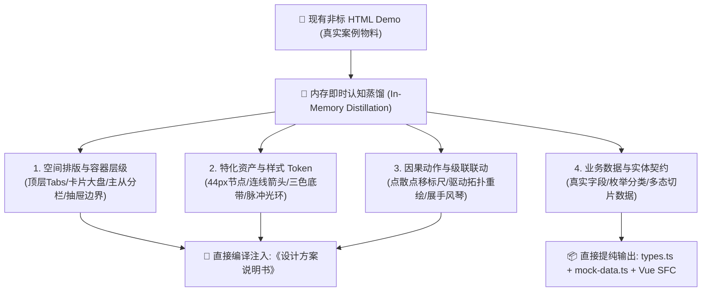

# 1.0 Demo 标杆案例即时认知蒸馏指南 (In-Memory Case Distillation)

> 💡 **核心定位**：
> 织雨（skill-designer-prism）之所以能输出极高还原度的设计说明书，核心在于其底层的**「标杆案例蒸馏库」**——将复杂交互与视觉样式提前沉淀为了像素级的经验硬指标（EP-xx）。
>
> **在 demo-to-spec 技能中，输入的原型 Demo 本身就是一个最真实的“活标杆案例”**！
>
> 我们不应走“走马观花的机械代码转译”老路，而必须在生成说明书前，**将现有的 Demo 作为一个完整案例，在内存中进行一次深度“即时认知蒸馏”**。
>
> **核心原则：无需中间物落库，直通规格编译**！
> 我们不需要在磁盘中生成繁琐的中间调研提案或更新全局知识库，而是**将蒸馏出的四维认知资产，直接、无损地编译注入到《设计方案说明书》与配套物料中**。

---

## 一、四维即时认知蒸馏框架 (4D In-Memory Distillation)

在开始写任何说明书文档之前，Agent 必须将输入的 HTML Demo 视为待剖析的标杆工程，在内存中完成以下 4 个维度的全面透视与蒸馏：

---

### 维度 1：空间排版与容器层级蒸馏 (Spatial Hierarchy)
* **蒸馏动作**：从顶层 `<main>` 或容器自顶向下扫描，剥离外层垃圾样式，透视其真实的排版韵律。
* **蒸馏所得**：
  * 主页面有几个 Tab 页签？每个页签承载什么主题？
  * 工作区是否具备复合排版？（如：上方 3 列资产概览卡片 `grid-cols-3` + 下方独立明细表）；
  * 哪些是属于当前视口的常驻容器，哪些是带 `x-show` / `fixed` 的侧边抽屉或模态弹窗；
* **说明书落点**：直接映射为说明书第二章的 **【居中】结构线框示意图 (Wireframe Layout)**。

---

### 维度 2：特化资产与样式 Token 蒸馏 (Visual Tokens)
* **蒸馏动作**：审查页面中 IDUX 基础库无法直接覆盖的特化视觉资产（如网络诊断拓扑链、离散散点时间线、4 色 SLO 阈值块）。
* **蒸馏所得**：
  * **几何尺寸**：节点宽高（44×44px）、连线粗细（2px）、箭头尺寸（10×8px）、时间线高度（142px）；
  * **色彩与透明度**：正常绿（`#12A679` 6%透明度）、一般橙（`#FA721B` 5%透明度）、异常红（`#F52727` 5%透明度）；
  * **虚线与描边**：分界虚线 `3 3`、折线虚线 `4 3`、散点白描边 `1.5px`；
  * **动效参数**：选中散点的蓝色外圈脉冲光环（`border-2 border-[#1C6EFF] animate-pulse`）；
* **说明书落点**：直接映射为说明书第二章的 **【置顶组件映射表】** 与 **【🎨 样式 Token 与工程还原字典】**。

---

### 维度 3：因果动作与级联联动蒸馏 (Interaction Cascades)
* **蒸馏动作**：跟踪 Alpine.js 或 Vue 指令（`@click`、`x-model`、`@change`、`x-effect`）及函数逻辑，梳理所有用户操作引发的多米诺骨牌效应。
* **蒸馏所得**：
  * **点散点联动**：点击时间线散点 ➔ 移动垂直蓝色标尺 ➔ 驱动 5 节点拓扑链切片重算 ➔ 异常节点变红 ➔ 下方自动定位并展开手风琴诊断详情；
  * **抽屉下钻**：点击卡片【查看清单】 ➔ 受控滑出 480px 抽屉 ➔ 传入分类上下文 ➔ 抽屉内开关变更回写主卡片数字；
  * **操作防御**：总引擎关闭时所有子开关置灰加锁；行内开关 300ms 防抖；失败自动回滚；删除弹窗 `IxPopconfirm` 二次确认；
* **说明书落点**：直接映射为说明书第二章的 **【🧭 页面核心交互动线与操作行为细则大表】** 与第三章的 **【状态机完备性大表】**。

---

### 维度 4：业务数据与实体契约蒸馏 (Data Contracts)
* **蒸馏动作**：从原 Demo 的数据对象（如 `ztnaApps`, `saasApps`, `customApps`, `probePolicies`）中提取业务字段与枚举。
* **蒸馏所得**：
  * 实体接口定义（去除下划线与非标字段，归一化为驼峰命名）；
  * 状态枚举（如 `'核心业务' | '协同办公' | '研发资产'`）；
  * 请求入参结构（搜索关键词、分类下拉、分页）；
* **物料落点**：直接映射为配套物料中的 **`types.ts`** 与纯净可运行的 **`mock-data.ts`**。

---

## 二、为什么“无需中间物落库”反而更稳定高效？

1. **零冗余、不产生过程垃圾**：
   传统离线蒸馏需要写调研报告、提修改建议、评审落库，适用于多项目跨期知识库沉淀；但在单个工程原型的“逆向编译迁移”场景中，**用户需要的是立即可交付的设计说明书与代码包**，中间报告毫无必要。
2. **端到端信息无损传递**：
   Agent 在同一个任务上下文中，一边“透视蒸馏”原 Demo 的所有排版、样式 Token 与交互动线，一边“即时编译”填入三章标准说明书模板中，不经过多层文件转存，**杜绝了传统信息转译中的细节丢包**。
3. **研发开箱即用，闭环直通落地**：
   内部平台前端拿到的是一份像织雨一样深厚、带真实 Token 字典、带交互因果大表、带开箱即用 Vue 3 SFC 物料的标准说明书，能够实现稳定、高品质的 1:1 还原。
