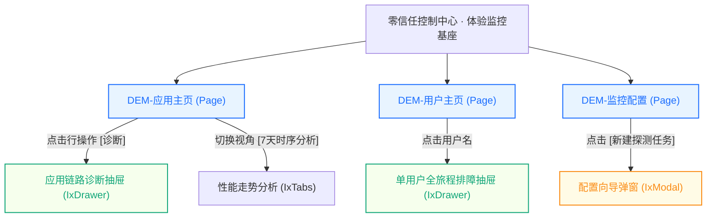

# 1.1 页面拓扑与路由关系提取规则 (Topology Extractor)

## 一、解析目标
将静态 HTML 文件、方案目录或复杂原型中隐藏的“页面跳转”、“弹窗浮层”、“下钻抽屉”以及“Tab 视图切换”等交互流，逆向还原为**清晰的结构层级拓扑与 Mermaid 路由图**。

---

## 二、识别模式与特征标记

### 1. 顶层页面 (Page)
- **特征**：独立的 HTML 入口文件、`window.DEM_ROUTES` 字典映射项、顶层菜单 `
` / `
` 对应的目标。
- **转换定性**：在内部平台作为独立的路由页面（Vue Router 路由表中的独立 `path`）。

### 2. 抽屉详情/排障面板 (Drawer)
- **特征**：
  - Alpine.js 标记：`x-show="isDrawerOpen"`、`x-transition:enter`、`@click="openDrawer(...)"`；
  - CSS 特征：`fixed inset-y-0 right-0`、`z-50`、`dem-drawer`、带暗色遮罩（backdrop）；
  - 触发点：表格行内的“诊断”、“查看详情”、“排障定位”等操作按钮。
- **转换定性**：属于对应 Page 的子组件，映射为 `<IxDrawer>`，不设独立路由，由当前页面状态受控。

### 3. 轻量确认/结果弹窗 (Modal)
- **特征**：居中浮层（`fixed inset-0 flex items-center justify-center`）、二次确认提示、单表单提交。
- **转换定性**：映射为 `<IxModal>` 或 `IxProFormModal`。

### 4. 视图切换页签 (Tabs / Segmented)
- **特征**：原 Demo 中使用 `@click="activeTab = ..."` 切换不同的子容器展示。
- **转换定性**：映射为 `<IxTabs>` 或 `<IxSegmented>`，子面板作为该页面的局部插槽或子组件。

---

## 三、容器骨架自顶向下解构规约 (Top-Down Container Walking)

在逆向任何 HTML 页面时，**绝对禁止直接看 JavaScript 数据数组或盲目搜索 `<table>`**！必须严格自顶向下回答「容器三问」：

1. **一问：主工作区顶层有几个 Tab 页签？**
   - 检查 `<template id="page-content-template">` 或 `<main>` 直接子节点中的页签按钮（如 `button @click="currentTab = ..."`）。
   - 提取真实的页签列表与命名，绝不允许将 3 个页签凭空拆分成 5 个，或将多页签强行合并。
2. **二问：主容器内部是否存在复合分排空间（如卡片大盘 + 明细表）？**
   - 检查主工作区的第一层直接子元素：
     - 若第一排是 `grid grid-cols-3` 或 `grid grid-cols-4`（KPI / 资产统计卡片），第二排是表格，则**必须忠实还原这种「上卡片 + 下明细」的复合结构**；
     - 严禁为了偷懒直接抹杀卡片，粗暴降维成单一大表格！
3. **三问：表格与表单究竟在主页面还是在 Drawer / Modal 里面？**
   - 检查任何 `<table>` 或 `<form>` 的祖先节点是否带有 `x-show="drawerOpen"` 或 `fixed inset-y-0 right-0`；
   - 凡是在抽屉或弹层中的元素，**物理上必须定性为 Drawer/Modal 规约**，严禁把抽屉内的数据强行拖到主页面渲染！

---

## 四、拓扑输出标准格式 (Mermaid)

技能在分析完 HTML 结构后，必须输出如下格式的标准 Mermaid 图表，用于填入总控说明书第一章：

---

## 五、复杂方案工程聚类与『1 + N』分册划分规则

当解析到方案包包含多个 HTML 文件（页面数 ≥ 2，或累计代码量 > 150KB）时，**解析器严禁将所有页面合并为单个文件**，必须按以下业务闭环与模板特征自动划分为 **1 个全局总控 + N 个模块分册**：

### 1. 全局总控说明书 (`00-[方案名]-全局架构与路由拓扑.html`)
- 包含方案内所有页面的清单大表与职责划分；
- 包含全系统级 Mermaid 流转拓扑图；
- 包含跨页面参数传递机制（URL Query 参数协议，如 `?userId=xxx&timestamp=xxx`）与共享 Pinia 状态定义。

### 2. 模块分册划分聚类原则 (`spec-0x-[模块名].html`)
- **原则 A【大盘与流转类】**：将概览看板与告警列表聚合为一册（匹配 `page-table-overview` 模板，如：首页态势 + 体验预警）；
- **原则 B【深度诊断排障类】**：将重度时序、网络瀑布流与单机/单应用画像聚合为一册（匹配 Master-Detail 诊断模板，如：用户详情排障 + 应用链路详情）；
- **原则 C【任务与规则配置类】**：将增删改查表单、向导与配置项聚合为一册（匹配 `page-form-drawer` / 穿梭框向导模板，如：监控配置）。
