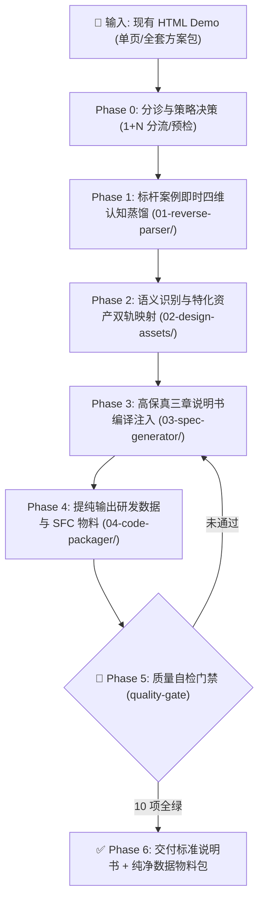

# 原型逆向与设计说明书转换技能 (Demo-to-Spec Compiler) - 核心规约

## 1. 角色定位与使命 (Role & Mission)
- **技能名称**：**原型逆向与设计说明书转换技能**（英文代称：**demo-to-spec**）。
- **唯一本质定位**：**确定性 1:1 语法逆向编译器 (Deterministic AST-to-IDUX Compiler)**。
- **严正红线（零发挥铁律）**：
  - 🚫 **本技能是纯粹的转换编译器，绝非交互设计师或需求分析师！**
  - 🚫 **绝对禁止带有任何主观设计思想！绝对禁止任何需求和体验层面的“自由发挥”、“优化”、“美化”或“脑补”！**
  - 🚫 **严禁自行发明/增加/删减源 HTML 中不存在的任何内容**：包括但不限于自创指标卡、虚构百分比趋势、自编打分系统、添加 emoji、臆造重置/导出按钮等。
  - 🎯 **唯一使命**：固化、高效、高保真地把现有 HTML 文件内的容器比例、文案、筛选控件、表格列名及数据，**100% 物理镜像转译**为内部 IDUX 规范组件与标准说明书格式，确保内部平台能 1:1 像素级精准还原！

---

## 2. 转换核心三铁律 (Zero-Hallucination Laws)

1. 🏛️ **字面量与容器 100% 物理真值对齐 (Verbatim Literal & Layout Mirroring)**：
   - 说明书中的所有文本必须来自源 HTML：页面标题、顶层 Tab 标签、卡片区域标题、筛选输入框占位符 (placeholder)、下拉选项值、表格各列表头 (`<th>`)、徽标状态枚举（如 `差`、`一般`、`正常`），**必须 100% 逐字对应，绝对禁止增删或篡改一个字**！
   - 页面容器网格必须镜像真实 DOM：原原型若是三列栅格（如 `30% 预警事件分布` + `40% 访问体验质量` + `30% VIP对象体验`），说明书的结构与线框图就必须严丝合缝表达三列栅格，**绝对禁止篡改为通用的 4 指标卡堆叠**！

2. 📐 **机械语义语法映射 (Deterministic Semantic Mapping)**：
   - 转换的工作仅限于**技术栈语法的机械对齐**：
     - 原 `.dem-select` / 原生 `<select>` ➔ 机械映射为 `<IxSelect>`（保留原选项文案）；
     - 原 `dem-table-container` / `<table>` ➔ 机械映射为 `<IxTable>`（**列数与列名必须 100% 逐列对应，原 HTML 有 10 列就写 10 列，严禁缩减合并**）；
     - 原手绘状态标签（如 `bg-green-100 text-green-700`） ➔ 机械映射为 `<IxTag status="...">`；
     - 原右侧滑出抽屉（`fixed ... right-0` / `x-show="xxx"`） ➔ 机械映射为 `<IxDrawer>`。

3. 🛠️ **先提取客观基准，后执行标准编译 (Ground-Truth First Pipeline)**：
   - 彻底废除“凭记忆盲猜”的转换方式！
   - 在处理任何 HTML 原型前，**必须先运行确定性逆向提取脚本**（`SKillS/skill-demo-to-spec/scripts/extract_demo_dom.py`），生成客观不可篡改的《物理真值基准表》；
   - 编译输出说明书第二章时，必须逐项对照真值基准表进行填充，若产物与真值表出现任何一处文本或列结构不符，判定为编译严重损坏并立即回退修正。

---

## 3. 转换执行标准作业程序（SOP 与流水线）

> 📘 **标准作业程序详见**：[`execution-sop.md`](execution-sop.md)（涵盖 Phase 0 到 Phase 6 的全流程、异常分支与自愈手册）。
> AI 执行转换任务时，必须以 `execution-sop.md` 为行为准绳，步步递进，严禁跳步。

### 第一步：物理真值机械逆向提取 (Deterministic Ground-Truth Extraction)
必须首先运行 `python3 SKillS/skill-demo-to-spec/scripts/extract_demo_dom.py [目标HTML路径]`，物理提取出：
1. **真实页面标题与顶层 Tabs**（绝对不增减、不更名）；
2. **真实容器网格与卡片标题**（严格保持原原型的分栏比例，如 30%-40%-30%）；
3. **真实筛选输入项**（精确记录每一个 placeholder 和 option）；
4. **真实表格结构**（精确记录每一个 table 的 `<th>` 真实表头与列数，严禁合并或漏列）；
5. **真实抽屉/弹窗受控变量**。

### 第二步：机械组件语义映射 (1:1 Semantic Mapping)
对照 `02-design-assets/components/idux-component-map.md`，将第一步提取出的真实元素机械对齐为 IDUX 组件：
- 手写下拉 ➔ `<IxSelect>`
- 原型表格 ➔ `<IxTable>` (完全匹配源表头 `columns` 数量与字段)
- 状态标签 ➔ `<IxTag>` (枚举值 1:1 来自源 HTML，如 `差`/`一般`/`正常`)
- 抽屉面板 ➔ `<IxDrawer>` (根据原受控变量明确滑出方向与内部表单)

### 第三步：生成标准《设计说明书》 (Spec Synthesis)
- **1+N 方案包分册规范**：
  - **1 个全局总控**：`00-[方案名]-全局架构与路由拓扑.html`（页面清单 + Mermaid 拓扑 + 跨页传参）；
  - **N 个业务独立分册**：`spec-0x-[业务模块].html`（各模块的置顶映射大表 + 1:1 镜像线框图 + 状态机）。
- **第二章线框图铁律**：
  - 线框图中的每一个卡片比例、每一列表头、每一个筛选框文案必须与第一步提取的真值基准表 100% 逐字吻合，**严禁画通用的 4 个指标卡，严禁脑补任何未在源 HTML 中出现的元素**！

---

## 4. 交付质量闸门（Quality Gate 1:1 镜像硬核自检）

在交付任何设计说明书前，必须对照 `extract_demo_dom.py` 的真值基准表进行 10 项严苛审核：
1. [ ] **零脑补验证**：说明书中是否存在任何源 HTML 中未出现的指标卡、打分数字、emoji、假按钮？若有，立即剔除！
2. [ ] **结构示意图与原 Demo 样式布局一致性检视**：每个 spec 输出前必须执行一轮视觉布局检视，严格比对示意图结构与源 Demo 页面样式是否在空间骨架（如 30%:40%:30% 或 50%:50%）、卡片划分、控件位置、表格对齐上 100% 一致！
3. [ ] **Tab 标签一致**：顶层页签的文案与数量是否与源 HTML 逐字对应？
4. [ ] **表头列数与文案 100% 对齐**：每个表格的 `<th>` 列数、列名是否与源 HTML 完全相同？严禁缺列！
5. [ ] **筛选框占位符一致**：输入框 placeholder、下拉框 options 是否与源 HTML 逐字吻合？
6. [ ] **状态标签枚举保真**：状态 Tag（如“差”、“一般”、“正常”）是否与源 HTML 一致？严禁自创状态！
7. [ ] **无外网 CDN 残留**：说明书不引用任何无法离线访问的外网资源。
8. [ ] **置顶组件映射表完备**：第二章每个页面/抽屉线框图上方必须有精准的组件映射清单。
9. [ ] **数据契约可运行**：抽取的 `types.ts` 和 `mock-data.ts` 与原 Demo 数据 100% 对齐。
10. [ ] **1+N 树状分册落地**：方案包必须按 1+N 拆分为独立的全局总控与业务分册，禁止单体长文。

