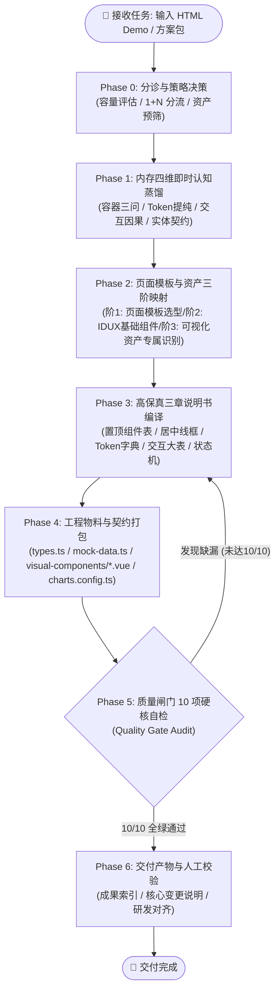

# Demo-to-Spec 原型逆向与设计说明书转换标准作业程序 (Execution SOP)

> **版本**：v1.0  
> **适用角色**：AI 编程助手（Antigravity / 转换 Subagent）、前端架构师、交互设计审查员  
> **核心使命**：以确定性、高保真、零遗漏的标准化流程，将非标 HTML/Alpine/Tailwind 原型 Demo 逆向编译为对齐内部 Vue 3 + IDUX 规范的标准《体验设计方案说明书》与高保真工程物料包。

---

## 0. 执行流转全景大盘 (Execution Architecture)



---

## Phase 0: 输入分诊与策略决策 (Triage & Strategy)

### 步骤 0.1：输入实体扫描与范围定界
- **检查输入形态**：
  - **单文件 Demo**：单一 HTML 文件（如 `DEM-监控配置.html`）。
  - **方案包目录**：包含多个 HTML 文件的完整解决方案（如 `Demos/07-方案七/`，包含监控大盘、用户排障、配置中心等）。
- **计算工程体量**：
  - 统计页面总数 $N$ 及累计代码体积（KB）。

### 步骤 0.2：架构拆解分流判定（1 + N 铁律）
| 判定指标 | 分流策略 | 产出物结构 |
| :--- | :--- | :--- |
| **页面数 = 1 且 体积 ≤ 150KB** | **单册标准说明书模式** | `spec-01-[业务模块].html` + 物料包 |
| **页面数 ≥ 2 或 体积 > 150KB** | **强制 1 + N 树状分册模式** | `00-[方案名]-全局架构与路由拓扑.html`<br/>+ $N$ 份 `spec-0x-[业务模块].html`<br/>+ 全局共享物料包 |

> [!IMPORTANT]
> **严禁输出单体巨石说明书**：对于方案包工程，绝对禁止把所有页面压缩进一个 HTML 文件。单体长文会导致 AI 上下文截断、排版被随意降维压平，且严重阻碍研发多团队并行开发。

### 步骤 0.3：页面模板初判与可视化资产专属预筛
在开始深入代码前，对页面骨架与资产进行两项关键预检：

1. **页面模板初筛 (Page Template Triage)**：
   - 快速比对 Common Design 14 种标准页面模板（`02-design-assets/page-templates/01-page-types.md`）：
     - 基础表格页 (`page-table-basic`)、左树表格页 (`page-table-tree`)、概览表格页 (`page-table-overview`)、Dashboard (`page-dashboard`)、下钻详情页 (`page-detail-drilldown`) 等；
   - **预判是否能直接匹配**：
     - 若形态契合标准模式 ➔ 标记待对齐的模板 ID；
     - **若找不到匹配的标准模板**（如：多区复合排盘、卡片大盘与明细深度联动、端到端全链路诊断复合页）➔ 标记为 **【定制复合页面模板】**，必须在说明书中单独进行高精度结构描述。

2. **可视化资产专属识别预筛 (Visual Asset Identification)**：
   - **核心认知**：**业务特化可视化资产绝对无法映射到标准 UI 基础组件库**（IDUX 没有也不应有专属业务图表）！
   - 扫描 HTML，登记是否包含以下四大常见可视化资产类型：
     - 📈 **趋势图 (Trend Charts)**：时序走势折线图、多指标堆叠面积图、实时延迟/丢包监控图、基线对比图；
     - 🌐 **拓扑图 (Topology Graphs)**：端到端网络诊断拓扑链（5 节点连线）、服务调用拓扑、微服务依赖图；
     - 📊 **可视化图表 (Advanced Visualizations)**：三色底带离散散点时序图、热力分布图、多维雷达图、漏斗图；
     - ⏱️ **业务图表/仪表盘 (Business Charts & Gauges)**：网络健康度半圆仪表盘、SLO 达标进度条带、卡片内嵌 Sparkline 微趋势图。
   - 若存在上述任意一种，在待办中建立 **【可视化资产提取清单】**，后续强制走 **ECharts 纯配置提取** 或 **Vue 3 SFC 单文件组件封装** 路线。

### 步骤 0.4：生成输出清单规划 (Output Manifest)
在内存中锁定即将生成的文件树（以方案七为例）：
```text
dist/ (或 用户指定输出目录)
├── 00-方案七-全局架构与路由拓扑.html
├── spec-01-监控大盘与预警中心.html
├── spec-02-用户与应用全链路排障定位.html
├── spec-03-探测任务与监控配置中心.html
├── types.ts
├── mock-data.ts
├── charts.config.ts               # 趋势图/通用图表 ECharts 纯净配置
├── visual-components/             # 特化可视化 SFC 组件包
│   ├── DemTopologyChain.vue       # 拓扑图资产
│   └── DemScatterTimeline.vue     # 可视化图表资产
└── README.md
```

---

## Phase 1: 物理真值机械逆向提取 (Deterministic Ground-Truth Extraction)

> [!IMPORTANT]
> **绝对禁止凭空脑补！必须先提取客观真值基准表！**  
> 转换任何 HTML 页面之前，必须首先执行确定性提取工具：
> `python3 SKillS/skill-demo-to-spec/scripts/extract_demo_dom.py <目标HTML文件路径>`
> 获得包含【页面标题、顶层Tabs、卡片区域字面量、真实表格所有th列、筛选框placeholder、操作按钮、抽屉表达式】的物理真值基准表。后续所有说明书的撰写，必须 100% 逐字对应此真值表，严禁凭主观臆造！

### 步骤 1.1：客观真值基准锁定 (Ground-Truth Lock)
1. **真实顶层页签锁定**：
   - 提取 `<main>` 下真实挂载的 Tab 个数与字面量（如 `站点分支`、`访问用户`、`应用`），禁止增删改。
2. **真实容器栅格与区域标题锁定**：
   - 解析 DOM 直接子容器的实际排布（如：左 30% `体验预警事件分布` + 中 40% `访问体验质量` + 右 30% `VIP对象体验`）。
   - **红线**：原 HTML 是什么结构，就记录什么结构；原 HTML 没有 4 个 KPI 指标卡，**严禁凭空添加 4 个 KPI 指标卡**！
3. **真实表格表头与列数锁定**：
   - 逐列登记所有 `<th>` 真实文字，原页面是 10 列就必须记录 10 列，原页面是 8 列就必须记录 8 列，严禁擅自合并或阉割！
4. **真实筛选输入与按钮锁定**：
   - 逐项登记 input placeholder、select 选项值与核心按钮文字，字面量必须 100% 吻合。
5. **弹窗与抽屉物理隔离**：
   - 检查 `x-show="drawerOpen"` 或 `fixed ... right-0` 容器，定性为独立 Drawer 子组件，禁止与主页面表格混淆。

### 步骤 1.2：可视化资产识别与样式 Token 蒸馏
将识别出的可视化资产按四大类型分别蒸馏关键参数（**绝不套用基础 UI 组件**）：

1. 📈 **趋势图参数**：
   - X 轴时间颗粒度（如 1min / 5min 采样）、双 Y 轴量纲（延迟 ms、丢包率 %）；
   - 预警基线阈值线（如红色虚线 100ms）、曲线平滑度（`smooth: true`）、面积渐变透明度（`0.1 ~ 0.02`）。
2. 🌐 **拓扑图参数**：
   - 节点几何尺寸（如 `44px * 44px` 圆形）、连线粗细（`2px`）、SVG 箭头（`10px * 8px`）；
   - 节点状态色：健康绿 `#12A679`、告警橙 `#FA721B`、故障红 `#F52727`；
   - 链路指标浮层（RTT、丢包率气泡 Badge）。
3. 📊 **可视化图表参数**：
   - 三色底带色值与透明度：优 `#12A679` (6% 透明度)、良 `#FA721B` (5% 透明度)、差 `#F52727` (5% 透明度)；
   - 散点白色描边（`1.5px`）、散点选中高亮（蓝色外圈脉冲光环 `border-2 border-[#1C6EFF] animate-pulse`）；
   - 垂直交互标尺：蓝色虚线指示线（`border-l-2 border-dashed border-[#1C6EFF]`）。
4. ⏱️ **业务图表/仪表盘参数**：
   - 仪表盘弧度与起始角度、SLO 达标分段色块、卡片微趋势图高度（`40px`）。

### 步骤 1.3：因果交互链与联动反应蒸馏
检索 Alpine.js/Vue 指令（`@click`、`x-model`、`@change`、`x-effect`）及相关 JS 函数，按以下 4 步链条解构交互因果：
- **触发源**：用户点击了什么元素（按钮、时间线散点、拓扑节点、卡片开关、行操作）；
- **即时反馈**：UI 发生什么瞬态变化（按钮 Loading、开关切换、节点高亮圈、散点放大）；
- **级联联动**：触发了哪些外部组件响应（如点击散点 ➔ 移动时间标尺 ➔ 驱动 5 节点拓扑链状态更新 ➔ 异常节点变红 ➔ 下方自动展开对应的手风琴诊断详情）；
- **边界与防御**：是否具备防抖（如 300ms）、是否包含防误触二次确认（`IxPopconfirm`）、失败是否自动回滚状态。

### 步骤 1.4：业务数据与实体契约蒸馏
- 解析原 Demo 中的 JS 数据对象（如 `ztnaApps`、`probePolicies`、`diagnosticChain`、`timelineSeries`）；
- 提取完整的实体字段、字段类型、枚举值分布；
- 记录原 Demo 的真实数据规模（如 ZTNA 包含 42 条资产），确保 Mock 数据具备 1:1 仿真度。

---

## Phase 2: 页面模板与资产三阶映射 (3-Tier Mapping)

建立由“页面级 ➔ 基础组件级 ➔ 可视化特化级”构成的三阶立体映射体系：

### 第一阶：页面级模板选型与映射 (Page Template Mapping)
严格对照 Common Design 页面模板库（`02-design-assets/page-templates/01-page-types.md`）：

1. **标准模板比对**：
   - 集中查询管理页 ➔ `page-table-basic` (基础表格页)
   - 分类层级列表页 ➔ `page-table-tree` (左树表格页)
   - **指标概览+数据明细页** ➔ `page-table-overview` (概览表格页)
   - 监控与大盘总览页 ➔ `page-dashboard` (Dashboard)
   - 独立详情页 ➔ `page-detail-drilldown` (下钻详情页)
   - 侧拉详情面板 ➔ `page-drawer-detail` (抽屉详情页)
   - 侧拉新建/编辑表单 ➔ `page-drawer-form` (抽屉表单页)
2. **⭐️ 关键规约：找不到匹配模板时的单独定制描述 (Custom Template Fallback)**：
   - **严禁生搬硬套！** 当页面属于非标复合排版（如方案七的“监控配置中心：卡片阵列大盘 + 独立明细表受控联动”，或用户详情页的“端到端 5 节点拓扑诊断 + 时序散点复合页”）：
   - **必须在说明书第二章中明确声明**：`选用页面模板：定制复合模板 (如 custom-monitor-config-composite)`；
   - **必须单独进行高精度结构描述**：
     - `① 页面空间骨架`：明确顶部 Header（48px）、上半区卡片大盘（高度 280px，3列卡片阵列）、下半区自适应表格明细容器；
     - `② 视口自适应规则`：卡片区固定高度，表格区吸底自适应滚动，抽屉独立遮罩；
     - `③ 主从联动机制`：卡片上的操作（如点击【查看清单】）如何受控呼出独立抽屉，抽屉变更如何反向更新主卡片。

### 第二阶：基础管理后台组件映射 (Standard UI Component Mapping - 轨 A)
严格对照 `02-design-assets/components/idux-component-map.md`，将通用 UI 元素映射为 IDUX 官方标准组件：
- 筛选表单栏 ➔ 水平排列 `<IxForm layout="horizontal">` + `<IxFormItem>`；
- 下拉选择 ➔ `<IxSelect>`（标明 `v-model` 与数据源绑定）；
- 数据列表 ➔ `<IxTable>`（完整定义 `columns` 配置数组，声明 `#cell` 自定义插槽）；
- 操作按钮 ➔ `<IxButton mode="primary | default | text" :loading="..." danger>`；
- 状态标签 ➔ `<IxTag status="success | warning | error | info">`；
- 侧滑面板 ➔ `<IxDrawer v-model:open="..." width="640px">`；
- 分页组件 ➔ `<IxPagination v-model:pageIndex="..." :total="...">`。

### 第三阶：可视化资产专属识别与保真提纯 (Visual Asset Identification & Extraction - 轨 B)
> [!CAUTION]
> **红线铁律：可视化资产绝对无法映射到标准 UI 组件库**！  
> 绝对禁止将横向拓扑硬套成垂直 `<IxTimeline>`，绝对禁止将三色底带散点时间线乱套成单色折线图！

根据四大资产分类，执行针对性提纯与封装：
1. **趋势图 (Trend Charts)**：
   - 提取为纯净 ECharts 配置（`charts.config.ts`），剥离 DOM 依赖；
   - 标明双 Y 轴配置、预警基线 MarkLine、Tooltip 格式化函数、`ResizeObserver` 自适应。
2. **拓扑图 (Topology Graphs)**：
   - 提取为独立的 Vue 3 SFC 单文件组件（如 `DemTopologyChain.vue`）；
   - 保留 44px 圆形节点、2px 彩色状态连线、SVG 箭头与气泡 Badge，支持节点与链路的点击 Emits。
3. **可视化图表 (Advanced Visualizations)**：
   - 提取为独立的 Vue 3 SFC 单文件组件（如 `DemScatterTimeline.vue`）；
   - 保留三色底带背景、白色描边离散散点、选中蓝色脉冲光环与垂直联动标尺。
4. **业务图表/仪表盘 (Business Charts & Gauges)**：
   - 提取为轻量级 SVG/Canvas 业务组件，封装刻度、指针与 SLO 分段色带。

---

## Phase 3: 高保真三章说明书规范编译 (Specification Synthesis)


严格按照 `03-spec-generator/spec-template.md`（分册）与 `global-overview-template.md`（总控）执行编译输出：

### 3.1 若为 1+N 方案包：首先编译输出《00-全局架构与路由拓扑》
- **全景系统定位与架构总述**；
- **全量页面与抽屉清单大表**（涵盖页面编号、模块名、路由 Path、功能定位、Common Design 规范类型）；
- **全局 Mermaid 页面交互流转拓扑图**（呈现主页面下钻、抽屉滑出、跨模块跳转关系）；
- **跨页面上下文与传参协议契约**（明确 Query/Pinia 参数与数据模型）。

### 3.2 编译输出各业务独立分册（`spec-0x-[业务模块].html`）
每个分册深入承载本业务的三章闭环详情：

#### 第一章：模块架构与业务流转拓扑
- 模块业务背景与 Common Design 模板定型；
- 模块内部局部 Mermaid 流转拓扑。

#### 第二章：核心页面与抽屉线框示意及组件选型（核心章节）
针对该模块下的每个页面和独立抽屉，严格执行 **“五步标准化装配”**：
1. **页面基本信息与模板映射定位**：
   - 说明路由 Path、适用角色、业务核心目标；
   - **页面模板判定与映射**：
     - 若命中 14 种标准模板，写明标准模板 ID（如 `page-table-overview (概览表格页)`）；
     - **⭐️ 关键：若找不到匹配的标准模板，在此处直接展开【定制复合页面结构描述】**：
       - 明确定义定制模板名称（如 `custom-monitor-config-composite`）；
       - 详述页面空间划分与比例（如：顶部 Header 48px、上方卡片大盘区固定高度 280px 3列栅格、下方表格自适应区、右侧 640px 独立抽屉）；
       - 详述视口自适应规则（表格区域内滚动、卡片大盘吸顶保持视野）；
       - 详述主从联动边界（卡片操作呼出抽屉，抽屉变更回写卡片度量）。
2. **【置顶】组件与资产选型映射清单大表**：
   - 必须**置顶于线框图上方**，包含 6 列表头：`区域/容器`、`资产类别 (标准UI / 趋势图 / 拓扑图 / 可视化图表 / 仪表盘)`、`原原型手写元素`、`映射 IDUX 组件 / 可视化实现方案`、`关键属性 (Props) / Token 规范`、`交互说明与事件`。
3. **【居中】结构线框示意图 (Wireframe Layout)**：
   - 采用结构化高保真 HTML/CSS 视觉线框排版（遵循 `wireframe-syntax.md` 与 `.wf-shell` 原语，严禁使用粗糙 ASCII 字符画）；
   - 严格体现 Phase 1 蒸馏得到的容器层级（完整展现标准模板骨架或定制复合排版，严禁压平）；
   - 线框内仅包含真实业务文案，绝不残留代码变量或标记语法。
4. **【特化资产】🎨 可视化资产样式 Token 与工程还原字典**：
   - 针对四大类可视化资产（趋势图、拓扑图、可视化图表、业务图表），以表格详列：`资产类型与名称`、`几何尺寸(px)`、`边框/线条(px)`、`背景/状态色(HEX)`、`微动效/阴影/阈值`、`工程还原说明 (SFC / ECharts)`。
5. **【交互动线】🧭 页面核心交互动线与操作行为细则大表**：
   - 以表格形式详列：`序号`、`交互触发源`、`触发手势/前置条件`、`即时视觉反馈`、`级联联动与数据流 (多米诺效应)`、`异常兜底与边界防御`。

#### 第三章：页面体验与异常保护规则
- **状态机完备性大表**：全覆盖 `未初始化 (Idle)`、`加载中 (Loading)`、`空数据 (Empty)`、`请求异常 (Error)`、`防重提交锁定 (Lock)`、`失败回滚 (Rollback)`；
- **研发交付前置确认大表**：对齐 API 依赖、安全鉴权与埋点需求。

### 3.3 专项检视：说明书示意图与源 Demo 页面样式布局 1:1 视觉一致性检视 (Visual Layout Audit)
每个 spec 编译完成后，必须将其第二章的【结构示意图】与对应的【源 Demo HTML 页面】进行 5 维视觉排版核验：
1. **容器栅格检视**：比对 Header 48px、主体左右/上下分栏比例（如 30%:40%:30% 或 50%:50%）是否与 Demo 样式一致；
2. **卡片视觉排布检视**：比对卡片内的数值字号、四级/三级等级分布布局（如 2×2 栅格、横向条状、纵向列表）是否完全一致；
3. **筛选栏控件位置检视**：比对操作按钮（居左/居右）、筛选下拉的排列顺序、搜索框宽度与占位符是否与 Demo 一致；
4. **表格展示规范检视**：比对各列宽度比、数字右对齐、操作居中对齐、状态胶囊色彩是否与 Demo 一致；
5. **抽屉/弹窗浮层检视**：比对抽屉滑出宽度（640px / 520px）、内部表单严格左右排版是否与 Demo 一致。
> 若发现任何布局偏差，必须立即就地修正说明书示意图，直至 100% 视觉保真后方可交付。

---

## Phase 4: 工程物料与契约打包 (Code & Material Packaging)

输出直接可供内部前端工程引入的纯净代码物料：

### 4.1 实体类型契约文件 `types.ts`
- 采用规范 TypeScript 语法，使用 PascalCase 命名接口；
- 字段名统一规范为小驼峰（camelCase）；
- 严禁出现 `any` 敷衍类型，必须定义严谨的联合类型与枚举。

### 4.2 独立 Mock 数据集文件 `mock-data.ts`
- 数据结构 100% 契合 `types.ts` 定义；
- 真实保留 Demo 中的业务文案、分类标签与数据量（如真实保留 42 条资产记录）；
- 纯 ES Module 导出，支持前端直接 `import`。

### 4.3 趋势图与通用图表 ECharts 配置 `charts.config.ts`
- 将原 HTML 中的内联图表脚本重构为纯配置生成函数（如 `getTrendChartOptions(seriesData, thresholds)`）；
- 剥离 DOM 依赖，包含双 Y 轴、时序格式化与自适应监听配置。

### 4.4 特化可视化 SFC 组件包 `visual-components/*.vue`
- 针对拓扑图（如 `DemTopologyChain.vue`）和高级可视化图表（如 `DemScatterTimeline.vue`），封装为完整的 Vue 3 SFC；
- 包含详尽的 Props/Emits TypeScript 类型与 scoped 样式。

### 4.5 工程物料集成说明 `README.md`
- 阐明交付包目录结构、组件引用示例、Mock 数据装配方法。

---

## Phase 5: 质量闸门 10 项硬核自检 (Quality Gate Audit)

在向用户宣布完成之前，**必须在内存中强制执行 10 项全项核验**。只有当 10 项全部打钩（10/10 全绿）时，方可通过。

```markdown
### 🚦 交付质量门禁核验表 (Quality Gate 10 铁律)

- [ ] **QG-00 [绝对阻断] 零发挥与真值 100% 镜像**：必须逐行对照 `extract_demo_dom.py` 输出的真值表自检，严禁出现源 HTML 中未曾存在的任何指标卡、虚构百分比趋势、自编打分系统、emoji 或臆造按钮！
- [ ] **QG-01 容器结构与分栏保真度**：页面容器栅格比例（如 30%-40%-30% 三栏）必须与原页面物理一致，绝对禁止擅自压平或脑补通用卡片。
- [ ] **QG-02 表头列数与文案 100% 吻合**：说明书中所有表格的 `<th>` 列数、列名必须与原 HTML 逐列对齐，原原型 10 列就写 10 列，严禁缩减。
- [ ] **QG-03 筛选控件与占位符吻合**：输入框 placeholder、下拉选项文字必须 100% 取自源 HTML 真实字面量。
- [ ] **QG-04 状态徽标枚举保真**：Tag 标签枚举（如“差”、“一般”、“正常”）必须与源 HTML 一致，严禁捏造状态。
- [ ] **QG-05 离线与内网兼容性**：100% 杜绝任何外网 CDN（jsdelivr, unpkg, google fonts 等），全部为离线内网可用。
- [ ] **QG-06 组件语义化映射精准**：手写元素严格映射为 IDUX 标准组件与 Token，严禁原生 HTML 元素残留。
- [ ] **QG-07 交互行为与状态机完备**：第二章包含《交互行为细则大表》，第三章包含异常四态（Loading/Empty/Error/防重锁）。
- [ ] **QG-08 数据契约真实可运行**：`types.ts` 和 `mock-data.ts` 与原 HTML 数据 100% 一致且可直接运行。
- [ ] **QG-09 复杂方案 1+N 分册铁律**：页面数 ≥2 或体积 > 150KB 时，已拆为 1 个全局总控 + N 个模块分册，无单体巨石。
```

> [!CAUTION]
> **红线阻断机制**：  
> 若自检发现任何一项未达标（例如发现将卡片大盘压平为了普通表格，或缺少了交互联动大表），**必须立即触发自愈回溯，重新编译修复受影响的分册，严禁带病交付！**

---

## Phase 6: 成果交付与用户校验 (Handoff & User Review)

### 6.1 交付呈现
向用户提供清晰的结构化交付摘要：
1. **产出物文件索引树**（带可点击的文件链接）；
2. **1+N 分册架构摘要**（说明 00 总控与各分册的职责边界）；
3. **特化可视化资产与样式 Token 清单**（列出封装的 Vue SFC 与核心 HEX 色值）；
4. **交互行为与级联联动覆盖概览**；
5. **质量门禁 10/10 自检通过声明**。

### 6.2 样式快修协同准则
如果用户在对话中提到 **“样式快修”** 关键词：
- 严格遵循用户自定义规则；
- 快速精确定位并调整 UI 细节代码与 Token 字典；
- **不要主动使用浏览器进行修改验证，留给用户自行在真实环境中验证**。

---

## 异常分支与自愈兜底手册 (Exception & Fallback)

| 异常场景 | 错误表现 | 自愈兜底策略 |
| :--- | :--- | :--- |
| **超长单体 HTML (> 200KB)** | AI 无法一次性全部读入，可能丢失后半段 | 采用分页或切片读取；严格提取 DOM 骨架大纲；强制按业务 Tab 拆分为 N 个分册依次编译。 |
| **未知/自定义复杂 Canvas 图表** | 原 Demo 中包含手写原生 Canvas 或混淆代码 | 逆向其数据入参与坐标系含义；在说明书中声明为自定义业务组件，输出同等尺寸的 Vue SFC 骨架与配置契约。 |
| **抽屉与主表混淆** | 把抽屉内的数据表格当成了主页面的主要视图 | 触发 Phase 1 容器第三问，通过 CSS `fixed`/`absolute` 及 `x-show="drawerOpen"` 识别抽屉，物理隔离为主表与抽屉两套独立线框。 |
| **交互联动丢失** | 说明书看起来是“死页面”，无用户操作反馈 | 检索 `@click`、`x-model`、`@change` 指令，补齐第二章《交互行为与操作细则大表》，说明联动多米诺效应。 |
